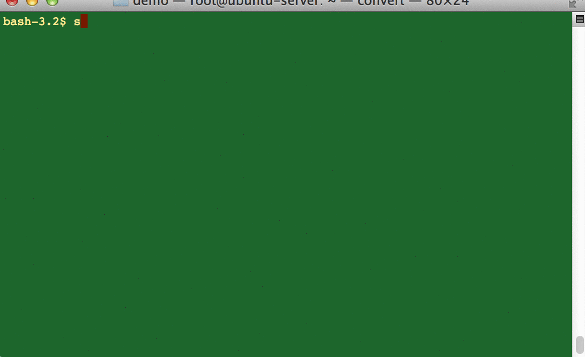

# git-quick-start

> 这是一个git的快速入门项目，使用一些gif图片来播放一些基础的git命令使用方法。

## 生成ssh-key
> 这里是使用ssh-keygen的默认配置生成了秘钥对，没有给私钥加密码，非常的简单，也很实用，注意私钥（~/.ssh/id_rsa）请谨慎保存，泄露了就如同泄露了密码一样
  

## Clone and push
> 没什么好说的，就是clone下来，编辑一些文件，提交然后push。
  

## 创建和切换分支
> 创建分支*git branch new_branch_name* 切换分支 *git checkout target_branch_name* ，哦忘了，删除分支是*git branch -D target_branch_name*
  

## 推送远程分支
> 推送远程分支很简单，*git push origin local_branch_name:remote_branch_name*
  

## merge
> merge用于合并分支，*git merge source_branch*
  

## tag
> 可使用git子命令tag来给版本打标签做标记，*git tag xxx*
  

推荐另外一个还不错的入门资料
[git guide](http://rogerdudler.github.io/git-guide/index.zh.html)
